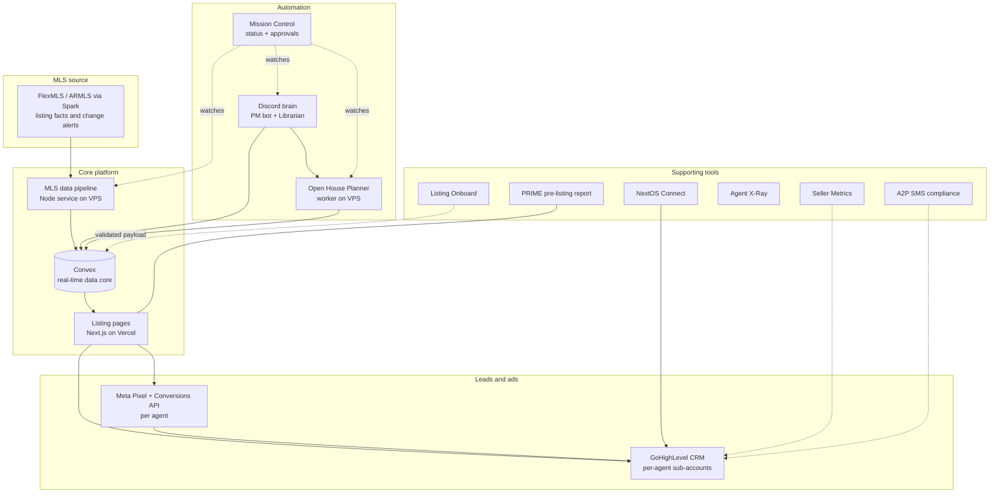

# NEXT System Architecture

This repository documents the technical system that runs NEXT's real-estate listing and lead operation. The system generates a branded property-listing website for every agent on the team, keeps those pages current with the multiple listing service, tracks advertising per agent, answers questions and files work from Discord, and returns every lead into the owning agent's customer-relationship management (CRM) account. It is built as a set of small, single-purpose services around one shared real-time data core (Convex), so each piece ships, is tested, and evolves on its own rather than as one monolith.

This README is the map. Each subsystem has its own document under `docs/`, written to be followed by a semi-technical reader and analyzed by a technical one.

---

## The big picture

Everything centers on two things in the middle: the **listing pages** that the public sees, and the **Convex data core** they render from. The **MLS data pipeline** feeds listing changes in. The **automation brain** (two Discord bots) and the **Open House Planner** worker act on the same data core. Leads flow out to **GoHighLevel** (the CRM) and are tracked by **Meta** advertising. A set of **supporting tools** sits around the edge.

Solid arrows are live data paths. Dotted arrows are supervisory or in-development connections. Mission Control watches the always-on automation and reports its health; the supporting tools connect in at the edges as each one reaches production.

---

## How a listing flows end to end

1. **A change enters through the MLS.** FlexMLS sends an alert email to a dedicated mailbox when a listing is created, repriced, or changes status. The MLS data pipeline polls that mailbox, verifies the message is genuinely from FlexMLS, and reads only the routing facts out of it (which listing, which agent, what kind of change).
2. **The change is matched and written.** The pipeline matches the alert to the right agent and writes the change into the Convex data core, keyed by MLS number. Authoritative property facts (beds, baths, square footage, photos) come from the licensed MLS feed, never from the email.
3. **The page renders.** The public listing page for that property, served by Next.js on Vercel, reads from Convex and rebuilds. The page is branded to the owning agent and carries photos, description, a map, a tour-booking calendar, and lead-capture forms.
4. **Automation and ads engage.** An open house typed into Discord is set on the live page by the Open House Planner. Each agent's Meta Pixel and Conversions API track visits and lead events for that agent's own advertising.
5. **Leads return to the agent's CRM.** A form submission or a booking creates a contact in the owning agent's GoHighLevel sub-account, tagged by source, routed to that agent, and dropped into an automated follow-up sequence that stops the moment the agent takes over the conversation.

The full data flow, the lead lifecycle across systems, and the technology stack are laid out in the [Architecture Overview](docs/00-architecture-overview.md).

---

## Contents

| Document | What it covers |
| --- | --- |
| [00 Architecture Overview](docs/00-architecture-overview.md) | The connective tissue: the end-to-end data flow, the lead lifecycle across systems, the technology-stack summary, and a plain-language glossary. |
| [01 Listing Pages Platform](docs/01-listing-pages-platform.md) | How a branded listing page is built and served: rendering, the Convex data model, the routing proxy, per-agent domains, SEO, tour booking, seller handoff, and per-agent ad tracking. |
| [02 MLS Data Pipeline](docs/02-mls-data-pipeline.md) | How listing changes enter the system: the poll loop, provenance checks, deterministic parsing, agent matching, the fail-closed write doors, and the status-change flow. |
| [03 Automation Brain](docs/03-automation-brain.md) | The two Discord bots (work-board intake and the read-only Librarian) and the Open House Planner worker, plus the safety line that keeps a chat message from acting on its own. |
| [04 CRM and Integrations](docs/04-crm-and-integrations.md) | The GoHighLevel CRM backbone, the Meta advertising integration, the A2P/10DLC SMS compliance tooling, and NextOS Connect (the FlexMLS-to-CRM activity sync). |
| [05 Supporting Tools](docs/05-supporting-tools.md) | The smaller single-purpose services around the edge: Mission Control, PRIME, Seller Metrics, Agent X-Ray, Listing Onboard, and the hosting layers. |

---

## What is live versus in development

The listing pages, the Convex data core, the MLS pipeline (up to human-reviewed publishing), the Discord bots, the Open House Planner, per-agent ad tracking, and Mission Control's health monitoring are **live and in use today**; fully unattended MLS publishing, seller-handoff email delivery, Mission Control's broader approval web app, and the emerging tools (PRIME, Seller Metrics, Agent X-Ray, Listing Onboard) are at varying stages of development, described honestly per subsystem in each document and summarized in the [Architecture Overview](docs/00-architecture-overview.md#status-at-a-glance).
