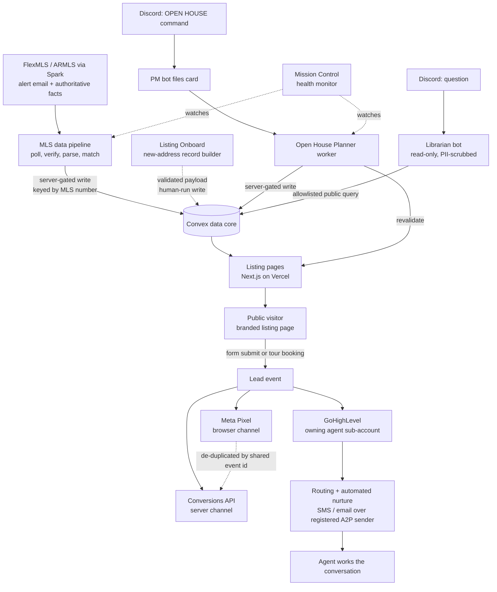

# Architecture Overview

_Part of the [NEXT System Architecture](../README.md)._

This document is the connective tissue between the subsystem documents. It traces the end-to-end data flow, follows a single lead across every system that touches it, summarizes the technology stack layer by layer, states honestly what is live versus in development, and defines the technical terms the rest of the documentation uses.

---

## 1. End-to-end data flow

The system has one shared real-time data core (Convex). The listing pages read from it; the MLS pipeline and the automation workers write to it; the CRM and the ad platform sit downstream of the pages. Every write door is authorized by a shared secret held only on the server and refuses to run without it.

The two design rules that recur everywhere:

- **The alert email is a doorbell, not the record of truth.** The MLS pipeline reads only routing and identity fields from an alert. Authoritative property facts come from the licensed MLS feed through a separate path, so a wrong factual value cannot reach a public page through the alert route.
- **Every write door fails closed.** Provenance, target resolution, and each write authorization refuse by default and proceed only on an explicit, valid signal. A misconfiguration suppresses writes; it never opens them.

---

## 2. The lead lifecycle across systems

A lead is the thread that ties the subsystems together. It is captured on a page, tracked by the ad platform, and worked in the CRM, all keyed to one agent.

1. **Capture.** A prospect submits an inquiry form or books a tour on a listing page, signs in at an open house, or clicks an agent's Meta ad. Each of these is a lead event.
2. **Track.** The lead event fires on two coordinated channels: the browser-side Meta Pixel and the server-side Conversions API. Both carry the same event id, so Meta counts the conversion once. Each agent tracks into their own Pixel and their own ad account, so attribution is isolated per agent.
3. **Land.** The lead is created as a contact in the owning agent's GoHighLevel sub-account, tagged by source (which listing, which campaign, which open house).
4. **Route and nurture.** A workflow in that sub-account assigns the contact to the agent and starts an automated follow-up sequence: an immediate first SMS or email, then a timed series of further touches, all sent over a carrier-registered SMS sender with an opt-out instruction. The sequence stops the moment the contact replies or the agent takes over.
5. **Work by hand.** The agent runs the conversation from there, inside the same sub-account, with the full capture-source and activity history attached.

The single organizing principle is **per-agent isolation with a shared shape**: every agent has their own listing pages, their own ad Pixel and Conversions credential, their own CRM sub-account, and their own SMS registration, yet all of them run the same pipeline stages, the same nurture workflows, and the same rules.

---

## 3. Technology stack

| Layer | Technology | Where it runs |
| --- | --- | --- |
| Listing-page rendering | Next.js 16 (App Router), React 19, TypeScript | Vercel |
| Real-time data core | Convex (hosted reactive database with server functions) | Convex cloud |
| MLS data pipeline | Node.js / TypeScript service, packaged in Docker | Linux VPS |
| Automation brain | Node.js / TypeScript, two Discord bots in one container | Linux VPS |
| Open House Planner | Node.js / TypeScript worker, its own Docker container | Linux VPS |
| Operations monitoring | Scheduled Node service posting to Discord | Linux VPS |
| CRM backbone | GoHighLevel (agency account, per-agent sub-accounts) | GoHighLevel (hosted) |
| Ad tracking | Meta Pixel (browser) + Conversions API (server) | Browser + Vercel serverless route |
| Transactional email | Resend or Gmail API, selected by environment | Vercel serverless |
| Work board | Trello (thin REST layer) | Trello (hosted) |
| MLS data source | FlexMLS / ARMLS via the Spark API (RESO Web API) | Licensed MLS provider |
| NextOS Connect (separate product) | React + Vite, Express, PostgreSQL (Neon) via Drizzle, Clerk auth, Stripe billing | Its own hosting |

The four hosting layers, at a glance: **web pages on Vercel**, backed by the **Convex real-time data layer**; the **always-on automation on a Linux VPS** in Docker; and **leads landing in GoHighLevel**.

---

## 4. Status at a glance {#status-at-a-glance}

| Subsystem | Status |
| --- | --- |
| Listing pages, portfolio pages, Convex data model | Live |
| Routing proxy, per-agent own-domain provisioning | Live |
| SEO / JSON-LD structured data | Live |
| Per-agent Meta Pixel + Conversions API tracking with de-duplication | Live |
| GoHighLevel tour-booking and contact-form embeds | Live |
| MLS pipeline: poll, provenance, parse, match, quarantine intake, readback verification | Live |
| MLS pipeline: fully unattended publishing to the public site | Gated off; requires two independent switches, and even then only status-only changes the server judges safe |
| Discord PM bot and Librarian bot | Live |
| Open House Planner worker (Discord-initiated, end-to-end write) | Live |
| Open-house feed that discovers events from the MLS on its own | Not built; open houses are initiated by a Discord command, not auto-detected |
| Mission Control: health monitoring + daily status board | Live internally |
| Mission Control: broader multi-tenant approval web application | In development; engine and safety rules built and tested, production web surface not yet wired |
| Seller-handoff feature: code, tables, security model, dashboard, form, summary | Built and tested |
| Seller-handoff real email delivery | Gated on a configuration step (sending-domain DNS); mail is recorded, not transmitted, until then |
| PRIME pre-listing report | Live public demo; report generation is a manual per-address run, automatic triggering not yet wired |
| Seller Metrics: engagement half | Works live on active listings |
| Seller Metrics: value half, seller-facing forms, CRM wiring | On hold / not yet built; in development |
| Agent X-Ray | Early; aggregation engine and public-web connector built and tested, not yet a live tool |
| Listing Onboard | Dry-run producer; builds and validates a write payload but does not write |
| NextOS Connect | Separate product; GoHighLevel provider path built and tested, Follow-up Boss path thinner |

---

## 5. Glossary

**A2P / 10DLC.** Application-to-Person messaging over 10-digit long codes. US carriers require any business sending SMS from a standard local number to be registered through this program, or the messages are filtered or blocked. Because every agent sends from their own number, each is a separate sender that must be registered.

**Allowlist.** A list of the only things permitted, with everything else denied by default. Used for the public fields a page may expose, the queries a bot may run, and the users who may command a bot. Safer than a denylist because anything new stays excluded until it is explicitly added.

**Conversions API (CAPI).** Meta's server-side event channel. The system reports ad conversions directly from its own infrastructure to Meta, rather than depending only on the browser tag, so events survive ad blockers and browsers that close early.

**Convex.** The hosted reactive database that holds all listing and agent data and runs the server functions that read and write it. It is the shared data core every subsystem connects through.

**Docker.** A way to package a service with everything it needs to run into an isolated container, so it behaves the same on the server as in testing. The always-on automation runs as Docker containers on a Linux VPS.

**Event de-duplication.** Sending the same conversion on both the browser Pixel and the server Conversions API, each carrying the same event id, so Meta recognizes them as one event and counts it once.

**Fail-closed.** A component that refuses to act when it is misconfigured or unauthorized, rather than acting anyway. A write door with a missing or wrong secret throws instead of writing.

**Idempotent.** Safe to run more than once without changing the result or creating duplicates. The CRM sync and the card-filing paths are built this way, so a retry or a redelivered message is a no-op.

**ISR / revalidation.** Incremental Static Regeneration. Pages are pre-built and served fast, then refreshed on a fixed interval (every 300 seconds) or on demand when the underlying data changes, so they are quick to serve but never far out of date. An on-demand **revalidate** call refreshes a specific page immediately after a data write.

**JSON-LD / structured data.** Machine-readable data embedded in a page that describes what the page is about (the property, the agent, the open houses) so search engines and AI answer engines can read it precisely.

**Magic-link sign-in.** Signing in by clicking a one-time link emailed to the user, instead of a password. The link mints a short-lived signed session. Used for the agent seller-handoff dashboard.

**Meta Pixel.** Meta's browser-side tracking tag. It fires when a visitor loads a listing page or completes a form and reports that event to Meta from the visitor's browser. Its identifier is public by nature.

**PII.** Personally identifiable information (name, email, phone, address). The system hashes it before sending it to Meta and strips it in code before any record reaches the Librarian bot or a chat reply.

**Provenance (SPF / DKIM).** Two independent email-authentication checks that together prove a message genuinely came from the domain it claims. The MLS pipeline rejects any alert whose sender and SPF/DKIM verdicts do not both point at FlexMLS, so a forged alert cannot drive a write.

**Proxy.** A single function in Next.js 16 that runs on every request before the page renders. Here it does host-to-agent rewriting for the own-domain feature and guards the seller-handoff dashboard. It is fail-safe: any error degrades to passing the request through untouched.

**Quarantine.** A holding state. A matched MLS change lands in quarantine and waits for release rather than publishing on its own, which is the conservative default for the pipeline.

**RESO Web API.** The real-estate industry's standard data interface, reached here through the Spark provider, and the authoritative source of property facts (as distinct from the alert emails, which only signal that something changed).

**Server Component / Client Component.** In Next.js, a Server Component renders on the server so the initial HTML is complete and search-friendly; a Client Component runs interactive behavior in the browser (a photo carousel, a booking modal). Listing pages are mostly server-rendered with interactive pieces marked as client components.

**Server-gated by a shared secret.** An authorization model where a function is public in form but refuses to run unless the caller presents a secret token that only the trusted server holds. Comparisons are constant-time, and the check runs before any database access. The document describes this mechanism; the secret values live only in the deployment environment.

**Slug.** The short, URL-safe identifier for an agent or a property that appears in the web address, for example the agent segment and the property segment of a listing URL.

**Snapshot (GHL).** A template of pipelines, tags, and automation workflows used to provision every new agent sub-account identically, so the roster stays consistent as it grows.

**Sub-account (GHL).** An isolated workspace inside the GoHighLevel agency account, one per agent, with its own contacts, pipelines, phone number, and workflows. One agent's leads are never visible in another's.

**VPS.** Virtual Private Server, the Linux machine that hosts the always-on automation (the MLS pipeline, the Discord bots, the Open House Planner, and the monitoring service) as Docker containers.

**WebP.** A compressed image format. Listing photos are normalized to WebP at appropriate resolutions so pages load quickly without losing visible quality.
