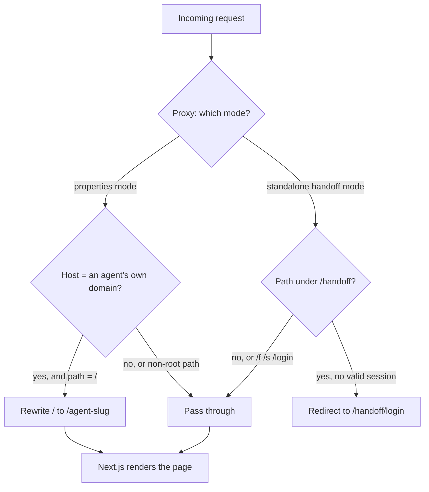

# Listing Pages Platform

_Part of the [NEXT System Architecture](../README.md). See also the [Architecture Overview](00-architecture-overview.md)._

This document describes the current listing-pages platform: what it is, how a page is built and served, the data it stores, the contracts between its parts, and how tracking, SEO, per-agent domains, seller handoff, and tour booking work. It is written to be followed by a semi-technical reader and analyzed by a technical one.

---

## 1. What the platform is

The platform generates and serves a branded property-listing website for each agent on the NEXT team. Every agent gets:

- A **portfolio page** at `properties.nextrealestate.team/{agent}` showing their current listings and past sales.
- A **listing page** per property at `properties.nextrealestate.team/{agent}/{property-slug}`, fully branded to that agent (their name, headshot, bio, phone, socials, brokerage logos), with photos, description, stats, map, testimonials, a tour-booking calendar, and lead-capture forms.
- Optionally, the same pages served under the **agent's own domain** (for example `homes.<agent-domain>.com`) instead of the team host.

The stack:

- **Frontend / rendering:** Next.js 16 (App Router), React 19, TypeScript, hosted on Vercel.
- **Backend / data:** Convex (a hosted reactive database with server functions). All listing and agent data lives here.
- **Third-party integrations:** GoHighLevel (GHL) for each agent's booking calendar and contact forms; Meta Pixel + Conversions API for ad tracking; an MLS data source (FlexMLS / ARMLS / Spark) as the origin of listing facts; Resend / Gmail API for transactional email; Discord for operational alerts.

Pages are **statically generated and incrementally revalidated** (ISR). Each page re-fetches its data on a fixed interval (300 seconds) and can also be revalidated on demand when the underlying data changes, so pages are fast to serve but never far out of date.

### Hidden demo pages

Any listing can be flagged `hidden`. A hidden listing renders its own direct URL fully and normally, so it can be used as a live demo or a staging page, but it is excluded from every discovery surface: the homepage gallery, the sitemap, the agent's portfolio page, "similar listings", the static-build manifest, and search-engine indexing (its page emits a `noindex` robots directive). It is reachable only by someone who already has the exact URL. This gives the team a way to build and show a real, working page for a property before it should be publicly discoverable.

---

## 2. Frontend architecture

### 2.1 The Proxy (host routing), not middleware

Next.js 16 replaces the older `middleware` convention with a **Proxy** (`src/proxy.ts`), a single function that runs on every request (except static assets) before the page renders. One Proxy serves two deployment targets, selected at request time by an environment flag:

**Properties mode** (the main `properties.nextrealestate.team` deployment):

- Its only job is **host-to-agent rewriting** for the own-domain feature. When a request arrives on an agent's own mapped host, the Proxy rewrites *only* the site root `/` to that agent's portfolio path `/{agent-slug}`. Every non-root path passes through untouched, because internal links already carry the agent slug, and re-prefixing them would break the URL.
- The team host, `localhost`, and Vercel preview URLs always pass straight through.
- The host-to-agent map is **baked at build time** (`src/lib/domain-map.ts`), so at request time the decision is a pure in-memory lookup with no network call.
- It is **fail-safe**: any error, or an unknown host, degrades to pass-through. The Proxy can never return a 500 or a 404 for the live team site.

**Standalone handoff mode** (a separate deployment, `next-handoff.vercel.app`):

- Redirects the bare root `/` to the agent sign-in page.
- Guards the agent dashboard at `/handoff` behind a session cookie. The seller form (`/f`) and the agent summary page (`/s`) stay open, because they are protected by unguessable tokens instead (see Section 7).
- This guard is a convenience only. The dashboard page re-verifies the session itself and never trusts the Proxy alone.

### 2.2 The listing route and how a page is composed

The core route is `src/app/[realtor]/[slug]/page.tsx`. `[realtor]` is the agent slug, `[slug]` is the property slug. There is also `src/app/[realtor]/page.tsx` (the agent portfolio) and `src/app/[realtor]/[slug]/open-house/page.tsx` (a dedicated open-house RSVP page).

A listing page is a **React Server Component**. On render it:

1. Fetches the listing and its owning agent from Convex through a data-access layer (`src/lib/listingData.ts`), which calls the Convex query and falls back to a small static stub (`src/lib/data.ts`) if Convex is briefly unavailable, so shipped pages stay live through a backend hiccup.
2. Fetches the agent's public tracking IDs (Meta Pixel id) for the current agent.
3. Emits several `<script type="application/ld+json">` structured-data blocks (Section 6).
4. Renders the page as a sequence of section components from `src/components/sections/`.

The page is assembled from discrete section components, roughly in this order:

- `HeroSection` (branded hero with the property's headline image and the agent's identity)
- `StatsBar` (beds / baths / sqft / price at a glance)
- `OpenHouseSnippet` + `OpenHouseSection` (self-hiding; shown only when a future open house is scheduled and the listing is not sold/withdrawn)
- `DescriptionSection` (the listing remarks)
- `ScheduleTourCta` (a seam call-to-action that jumps to the booking anchor)
- `PropertyDetailsSection`, `PhotosSection` (gallery), `MapSection`
- `MlsLinkCta`, `MidCtaSection`
- `GhlCalendarEmbed` (the tour-booking widget, Section 8)
- `TestimonialsSection`, `MeetYourAgentSection`, `RealtorSocialsSection`
- `HomeWorthSection`, `GhlContactFormEmbed` (lead-capture form)
- `SimilarListingsSection`, `FaqCtaSection`
- `ContactBarSection`, `FooterSection`

Interactive pieces are **Client Components** (marked `"use client"`): the photo gallery carousel, the tour-calendar modal, the chat widget, the sticky mobile call-to-action, the exit-intent capture, and the lead tracker. Everything else renders on the server, so the initial HTML is complete and SEO-friendly.

A **sold or closed** listing stays published permanently (it is portfolio and SEO weight) and simply renders a "SOLD" banner; all its open-house surfaces are suppressed.

### 2.3 How listing data enters the system

Listings originate from MLS activity. The pipeline (in `convex/listingPages.ts` and related files):

1. **Event capture:** MLS notifications (new listing, coming soon, price change, status change, back on market, sold, withdrawn, expired, under contract) are recorded as rows in the `listingPages_mlsEvents` table, de-duplicated by the source email's message id.
2. **Agent matching:** an automated matcher assigns each event to an agent. It matches by MLS number first (authoritative when a listing already exists), then by exact name match, then by name-token overlap, then by a distinctive single-token fallback. Unmatched events are parked as `no_match` and can be replayed once the agent exists.
3. **Publish gate:** a matched event does **not** publish on its own. Publishing requires an explicit confirmation step (a reviewer confirms the scraped facts and that the price agrees with the source) before the page is built or updated. A separate conservative auto-path exists for **status-only** changes with a confidently derived status (for example a straightforward "pending" or "back on market"); anything price-bearing, brand-new, or terminal (sold/closed) always falls back to human review. This gate fails closed: without confirmation, nothing publishes.
4. **Build / update:** on publish, listing facts are written to `listingPages_listings`, and the live Vercel page for that path is revalidated (Section 2.4).

Listing photo URLs are normalized to WebP at appropriate resolutions (native quality for the hero, width-capped for gallery images). Scraped free-text is HTML-escaped before storage because the description is rendered as HTML.

### 2.4 On-demand revalidation

`src/app/api/revalidate/route.ts` accepts a `POST` carrying an agent slug and property slug, gated by a **shared secret** in a request header (fail-closed: no secret configured, or a mismatch, returns 401). It revalidates both the listing path and its `/open-house` child path (the child does not cascade automatically). This is how a data write in the backend causes the corresponding live page to refresh promptly instead of waiting for the 300-second interval.

---

## 3. The Convex data model

All persistent data lives in Convex tables, defined in `convex/schema.ts`. Table and field names below are the real ones. Each table lists its important fields; every table also carries Convex-internal `_id` / `_creationTime` plus `created_at` / `updated_at` timestamps.

### `listingPages_realtors` (one row per agent)

The agent identity and branding record. Key fields:

- Identity / routing: `slug` (string, the URL segment), `name`, `name_first`, `email`, `phone_raw`, `phone_display`, `website`, `title`, `license_number`, `bio`.
- Service area: `service_areas`, `area`, `office_city_state_zip`, `office_address_line1`, `office_address_line2`, `service_area_disclaimer`.
- Branding assets: `headshot_url`, `brand_logo_url`, `homesmart_next_logo_url`.
- GHL integration: `ghl_location_id` (the agent's GHL sub-account handle, internal), `ghl_calendar_embed_url`, `ghl_contact_form_embed_url`, `ghl_appointment_url`, `ghl_main_site_url`, plus `embed_discovery_status` / `embed_discovery_attempted_at` (bookkeeping for auto-discovering those widget URLs).
- Socials & proof: `social_links` (object of facebook / instagram / linkedin / youtube / tiktok / twitter), `testimonials` (array of `{reviewer_name, reviewer_role, rating, content, source}`).
- Optional co-agent (partner model): `partner_name`, `partner_first_name`, `partner_headshot_url`, `partner_title`, `partner_bio`. When unset, pages render exactly as a single-agent page.
- Own-domain: `serving_domain` (optional; the agent's own host, or unset to use the team host). See Section 5.
- `uses_vercel_template`, `listing_scope` (optional).

Indexed by `slug`, `ghl_location_id`, `email`, and `serving_domain`.

### `listingPages_listings` (one row per property)

- Ownership / routing: `realtor_slug`, `url_slug`, `mls_number`.
- Lifecycle: `status` (one of Active, Pending, Closed, Coming Soon, Temp Off Market, UCB [under contract], Withdrawn, Cancelled, Expired, Archived), `hidden` (optional demo flag, Section 1).
- Address / geo: `address_line_1`, `address_line_2`, `city`, `state`, `zip`, `cross_streets`, `neighborhood`, `subdivision`, `school_district`, `latitude`, `longitude`.
- Property facts: `dwelling_type`, `dwelling_styles`, `exterior_stories`, `interior_levels`, `bedrooms`, `full_bathrooms`, `half_bathrooms`, `total_bathrooms`, `year_built`, `approx_sqft`, `approx_lot_sqft`, `approx_lot_acres`.
- Media: `hero_image_url`, `description_image_url`, `photos` (array), `video_url`, `instagram_embed_url`.
- Content / SEO: `description_headline`, `description_body_html`, `description_short`, `seo_keywords`, `meta_title`, `meta_description`.
- Pricing / dates: `list_price`, `list_date`, `expiration_date`.
- Open houses: `open_houses` (optional array of `{date, start_time, end_time, notes}`, in America/Phoenix time).
- Integration bookkeeping: `vercel_url`, `ghl_redirect_set`.

Indexed by `(realtor_slug, url_slug)` and by `mls_number`.

### `listingPages_mlsEvents` (the ingestion queue)

One row per MLS notification. Fields: `mls_number`, `realtor_slug` (once matched), `event_type` (new_listing / coming_soon / price_change / status_change / back_on_market / sold / withdrawn / expired / ucb), `status`, address fields, `list_price`, `previous_price`, `listing_agent_name`, `email_message_id`, `email_received_at`, `raw_email_subject`, and a `processing_status` (pending → matched / no_match / page_exists → page_built / redirect_set / complete / failed) plus `processing_error`. Indexed by mls_number, message id, status, and realtor.

### `listingPages_redirects`

Records the redirect wired in GHL from an agent's old GHL-hosted listing URL to the new Vercel page: `realtor_slug`, `ghl_location_id`, `source_path`, `destination_url`, `mls_number`, `ghl_page_id`, and a `verification_status` (pending / verified / failed).

### `realtor_secrets` (per-agent tracking / ad credentials, server-side only)

A separate, server-only store so tracking credentials never sit on the public agent record. Fields: `realtor_slug`, `ghl_location_id`, `meta_pixel_id`, `meta_capi_token`, `meta_page_id`, `meta_ad_account_id`, `ga4_id` (each nullable). Indexed by slug and location. The Pixel id is public by nature (it ships in the browser); the Conversions API token is sensitive and is read only server-side (Section 4).

### `capi_event_log` (tracking audit trail)

One row per server-side Meta conversion event: `realtor_slug`, `event_id` (the dedup key), `event_name`, `request_payload`, `response_status`, `response_body`, `created_at`. Indexed by `(slug, time)`, by event id, and by event name.

### Seller-handoff tables (isolated, prefixed `handoff_`)

Deliberately separate from the listing tables so the sensitive property-servicing data they hold is walled off. Detail in Section 7.

- `handoff_records`: `realtor_slug`, `seller_email`, `property_address`, `status` (sent / opened / partial / complete / revoked), `form_token`, `summary_token`, `form_token_used`, a slim optional `payload` (access notes, service providers, trash schedule, a free-text catch-all), plus `submitted_at` and `archived`. Indexed by form token, summary token, realtor, and `(realtor, status)`.
- `handoff_login_tokens`: `email`, `token`, `expires_at`, `used` (the agent magic-link tokens).
- `handoff_events`: an append-only per-record audit log (`record_id`, `kind`, `at`, `detail`).
- `handoff_ratelimit`: a sliding-window counter (`key`, `at`) shared by the anti-abuse throttles.

### `ags2_distressed_leads` / `ags2_outreach_log`

A separate, public-records-only lead-research store (distressed-property leads and an outreach log with a 90-day exclusion window). Not part of the public listing pages.

**How the tables relate:** `listingPages_realtors` is the hub. Listings, secrets, MLS events, redirects, and handoff records all reference an agent by `realtor_slug` (or `ghl_location_id`). A listing joins to its agent on slug; an MLS event resolves to an agent through matching; a handoff record reuses the agent row only for identity and branding.

---

## 4. Function contracts and the authorization model

Convex functions come in three visibility levels, and this distinction is the security backbone:

- **Public queries/mutations** are callable by anyone who knows the deployment URL. They must never return anything sensitive.
- **Server-gated** functions are public in form but refuse to run unless the caller presents a **shared secret** (a token held only by the trusted server). They are the write doors and the sensitive-read doors.
- **Internal** functions cannot be called from outside at all; only other backend functions invoke them.

Two cross-cutting protections back this up:

**Public projection.** The public listing/agent queries never return the raw database row. They pass it through an explicit **allowlist** (`src/lib/publicProjection.ts`) that copies only render-on-the-site fields. Internal identifiers (the GHL location id, embed-discovery bookkeeping, the listing's redirect flag, Convex internals) are dropped. It is an allowlist, not a denylist, so any new field added to the schema later stays private by default. The three GHL **widget URLs** the public page actually renders in iframes (booking calendar, the tour-request fallback link, the contact form) are intentionally on the allowlist, because an anonymous visitor already sees them.

**Fail-closed gating.** A server-gated function checks its secret **before any database access**. If the secret is unset on the deployment (a misconfiguration) or the caller's token does not match, it throws. Token comparisons use a constant-time equality check. The effect: a misconfigured deployment errors instead of leaking.

### Key public queries (listing pages)

- `getListingByRealtorAndSlug(realtor_slug, url_slug)` → the projected listing + agent, or null. This is what a listing page render calls.
- `getRealtorBySlug(slug)` → projected agent, or null.
- `getRealtorByDomain(serving_domain)` → projected agent by their own host (used by provisioning's occupancy check).
- `getListingByMlsNumber(mls_number)` → minimal public listing locator by MLS number.
- `getAllActiveListings()` / `getAllRealtorsForBuild()` / `getListingsWithOpenHouses()` → the manifests that feed the static build, sitemap, and homepage gallery. All of them exclude `hidden` listings.
- `getSoldEventDates(mls_numbers)` → the latest sold-event timestamp per listing, used to order "recently sold".

### Key internal / gated writes

- `upsertRealtor`, `upsertListing`, `deleteListing`, `recordMlsEvent`, `updateMlsEvent`, `recordRedirect` → internal mutations. Not callable from outside; the ingestion pipeline drives them.
- `setOpenHouses(realtor_slug, url_slug, open_houses)` → internal mutation that replaces a listing's open-house schedule. Its argument shape is frozen by a **versioned contract** (`src/lib/contracts/setOpenHousesContract.ts`); any change to the shape must bump the contract version, or a drift test fails.
- `setListingReel(...)` → internal mutation to swap a listing's video / Instagram reel field.

### Token-gated "front doors" for automation

Some backend actions need to be triggered by an external automation worker that must **not** hold full admin credentials. For those, the system exposes a public **action** that authenticates the caller with a **scoped shared secret** (a different secret per door, so any one can be revoked independently) and then calls the internal function. Each reads its secret first and fails closed. Examples:

- `fleetPromoteMatchedEvent(authToken, eventId, factsReviewed, priceAgreesWithSource, …)` → the token proves *who* is calling; the two boolean confirmations prove *that a human reviewed it*. These are independent facts, and both must hold to publish. The token never substitutes for review.
- `fleetAutoPromote(authToken, eventId, …)` → the conservative status-only auto-path; it publishes only when a pure classifier positively recognizes a safe status-only change, and refuses everything else to human review.
- `fleetSetOpenHouses(authToken, realtor_slug, url_slug, open_houses)` → the write door for the open-house automation. It validates the schedule against the versioned contract, **merges** the incoming schedule with the listing's existing future open houses (rather than clobbering, so a second open house weeks later is added not lost), writes through the internal mutation, then triggers a revalidate so the live page updates. An empty array is treated as an explicit clear.

**Note on naming:** classify these doors by behaviour (does it throw without the secret), not by argument name. Several gated functions name their secret argument differently but all enforce the same fail-closed rule.

---

## 5. Per-agent own domains

By default an agent is served at `properties.nextrealestate.team/{agent}`. An agent can instead be served at their own host, for example `homes.<their-domain>.com`, while the same Vercel deployment renders the pages.

**How it resolves.** The single source of truth is the agent's `serving_domain` field. From it:

- A **canonical URL helper** (`src/lib/site-url.ts`) returns `https://{serving_domain}` when set, else `https://properties.nextrealestate.team`. Every canonical tag, Open Graph URL, and sitemap entry derives from this helper, never from the live request host, so the value is deterministic and survives caching.
- A **build-time domain map** (`src/lib/buildDomainMap.ts`, baked into `src/lib/domain-map.ts`) inverts this into a `host → agent-slug` lookup that the Proxy uses to rewrite the root (Section 2.1). The map builder is deliberately **fail-loud**: it throws on an empty map (unless explicitly allowed before the first domain is provisioned), on a domain that equals the team host, or on a duplicate host, so a bad value never silently un-maps every agent's domain during a routine deploy.

**Validation.** `serving_domain` must be a bare lowercase host (no scheme, path, port, trailing dot, or bare IP) and must never equal the team host. This rule is enforced identically at write time (the Convex mutation), at map-build time, and in a shared validator, so a stored value always maps.

**Provisioning.** A domain is provisioned by an orchestrator script (`scripts/provisioning/orchestrator.ts`) that runs a seven-step, resumable, probe-then-act pipeline. Dry-run is the default; a live write requires an explicit `--execute` flag *and* the relevant credential present. Steps:

1. Read the DNS zone (via a DNS registrar API) and confirm the `homes` label is free or already owned by this agent (an inert `_next-managed` sentinel record marks ownership).
2. Attach the `homes.<domain>` host to the Vercel project and read back the CNAME target and any ownership-verification challenge.
3. Write the DNS records (the CNAME pointing at Vercel, the ownership marker, and any verification TXT). The sentinel is written first so a partial failure is always recoverable.
4. Poll Vercel until the host verifies.
5. Write the agent's `serving_domain` in Convex.
6. Trigger a production redeploy so the new host enters the baked domain map.
7. Print an acceptance report.

Each step reads live state first and does only the missing work, so a re-run after a partial failure resumes cleanly with no state file. A matching **rollback** script reverses a run: it deletes only the records it provably owns (never an unmarked record, which it reports for a human), detaches the Vercel host, and clears `serving_domain`.

Until a redeploy finishes, a freshly provisioned root simply serves the team homepage, by design, never an error.

---

## 6. SEO and structured data

The listing route builds rich metadata and structured data on the server so search engines and AI answer engines can read the page fully.

**`generateMetadata`** (per listing) produces:

- **Title:** built from address, city/state/zip, and bed/bath, then prefixed with the agent's name and their correct representation role ("Listing Agent" or "Buyer's Agent", branched on which side of the deal the agent is on, so a buyer-side listing never makes a false "listing agent" claim). Price is intentionally stripped from the title.
- **Description:** the stored meta description or a built one, prefixed with the agent name and role.
- **Keywords:** generated from city, neighborhood, subdivision, school district, cross streets, beds, and dwelling type.
- **Canonical URL** and **Open Graph / Twitter** cards, all built from the per-agent canonical helper (Section 5), with the hero image resolved to an absolute URL.
- **Geo meta** (Dublin Core / ICBM latitude-longitude conventions) for engines that consume it.
- The agent headshot as the page favicon / touch icon.
- For a `hidden` demo listing, a `noindex, nofollow` robots directive; nothing else about the page changes.

**JSON-LD structured data** emitted on each listing page:

- `RealEstateListing` (schema.org): name, description, canonical URL, image set, `PostalAddress` (with cross street when known), `GeoCoordinates`, an `Offer` (price, currency, availability, and the agent named as the seller when applicable), bedroom/bathroom counts, floor size, lot size, year built, and additional properties (neighborhood, subdivision, school district, property type, style, MLS number).
- A standalone `RealEstateAgent` entity (also present on the portfolio page) with the agent's contact info, job title, area served, office address, `worksFor: HomeSmart NEXT`, and their social profiles as `sameAs`.
- A `BreadcrumbList` (NEXT → agent → property).
- A `FAQPage` built from the listing's generated FAQ.
- `Event` entries for each upcoming open house, when scheduled.

The agent portfolio page (`src/app/[realtor]/page.tsx`) emits its own `RealEstateAgent` JSON-LD and its own canonical/OG metadata.

`robots.ts` and `sitemap.ts` generate the site's robots file and sitemap; both honor the `hidden` exclusion and the per-agent canonical host.

---

## 7. Seller property handoff

A self-contained feature that lets an agent collect property-servicing details from a seller (access notes, service providers, trash schedule, plus a free-text catch-all) through a branded web form, and then view a private summary. It runs on its own deployment (`next-handoff.vercel.app`) and its own isolated `handoff_*` tables, and reuses only the agent identity record for branding.

**The three surfaces and how each is protected:**

1. **Agent dashboard** at `/handoff`, behind a **session cookie**. The agent signs in by magic link.
2. **Seller form** at `/f/{form_token}`, reached by an **unguessable 128-bit token**, no login.
3. **Agent summary** at `/s/{summary_token}`, reached by a **different unguessable 128-bit token**.

**Magic-link sign-in flow:**

1. The agent enters their email at `/handoff/login`.
2. The server calls a gated function that mints a 15-minute, single-use login token **only if the email matches an existing agent record**. The response is always a generic "check your inbox", so the endpoint cannot be used to discover who is or is not an agent.
3. The emailed link mints a signed session (a short-lived JWT), set as an `httpOnly`, `Secure`, `SameSite=Lax` cookie, and redirects to the dashboard.
4. The Proxy guards `/handoff`, and the dashboard component independently re-verifies the cookie (defense in depth).

**The token model.** Each handoff record carries two independent tokens: a `form_token` (the seller's edit link, single-use for final submit) and a `summary_token` (the agent's private view link). Possession of the exact token *is* the identity on those paths. The seller's form token returns only that record's data; it never returns the agent's summary token. The two are minted from the runtime's cryptographic RNG.

**Function security posture.** Every agent-facing handoff function is **server-gated and fail-closed** (throws if the gating secret is unset or wrong, before any database access). Exactly **three** functions are callable without that secret, and each is reachable only via the exact form token:

- `submitHandoff(form_token, payload)`: final submit. Reject order: not-found, then revoked, then already-used (revoked always wins).
- `getForm(form_token)`: returns the form's fields, the seller's prior answers, and the agent's name/title for branding. Refuses a revoked or unknown token.
- `savePartial(form_token, payload)`: autosave of an in-progress form, without consuming the single-use token. It is size-capped and rate-limited per token (a public endpoint reachable with only the token).

Everything else (`createHandoff`, `getSummaryFull`, `listHandoffs`, `resendHandoff`, `revokeHandoff`, `reopenHandoff`, `archiveHandoff`, `requestLogin`, `consumeLogin`, `checkRateLimit`, `recordDeliveryFailure`) is server-gated. Agent-owned operations additionally check ownership: an agent can only touch records whose `realtor_slug` matches their signed-in session, so agent A can never read or modify agent B's records. The sensitive collected payload is returned by exactly one path, the server-gated summary read, plus the seller's own form token. A test enumerates every exported function and locks this public allowlist, so a newly added ungated function fails the build.

**On submit**, the record is marked complete, an audit event is written, and the submit route emails the **agent** (never the seller) a notification containing only the summary link and the agent's email address, never the collected codes. If that email fails to send, a gated observability call records a delivery-failure event and (optionally) alerts a Discord webhook; the seller's saved submission is never disturbed by an alerting failure.

**Branded email.** All handoff emails (invite, notification, sign-in) render through one shared template (`src/lib/handoff/emailTemplate.ts`). Delivery goes through a pluggable sender interface with several adapters selected by environment: a log-only adapter (records, sends nothing, the safe default until sending DNS is set), a Resend adapter, and a Gmail-API adapter that sends from a Workspace mailbox whose domain already has valid SPF/DKIM. Every email header value is sanitized to prevent header-injection. Going live with real delivery is a separate, human-gated configuration step.

A **sandbox preview** of the seller form exists at `/f-preview`: it runs the real form component with autosave and submit stubbed out, prefilled with sample data, so the full flow through the "thank you" screen can be demoed with no backend and no live record.

---

## 8. Tour booking

Each agent's listing page carries a "Schedule A Tour" section (`src/components/embeds/GhlCalendarEmbed.tsx`) anchored at `#schedule`. Several call-to-action buttons across the page link to that anchor.

- The agent's GHL booking calendar id is parsed from their stored `ghl_calendar_embed_url` (with an optional code-level override to point a test agent at a new calendar without a data write).
- Clicking "Book A Tour" opens the GHL booking widget in a modal iframe. The property's address is pre-filled into the booking form via GHL's query-key mechanism, so the agent sees which listing the tour is for.
- If no calendar id is available, the section degrades to a "Request A Tour" link pointing at the agent's GHL appointment URL, so the call-to-action is never dead.

---

## 9. Per-agent ad tracking (Meta Pixel + Conversions API)

Each agent runs their **own** Facebook/Meta tracking, driven by the per-agent `realtor_secrets` row. Tracking fires on two coordinated channels that are de-duplicated against each other.

**Browser channel (Meta Pixel).** `src/components/MetaPixel.tsx` is a server component that injects the standard Pixel base script initialized with **that agent's** `meta_pixel_id`. Different agents therefore fire into their own Pixels. It fires a `PageView` on load and publishes a page-render event id onto `window.__nextEventId`. The Conversions-API token never reaches this component or the browser.

**Server channel (Conversions API).** `src/app/api/capi-lead/route.ts` is a Node server route that:

1. Receives a lead event (from the GHL contact-created webhook as the primary source, or directly from a browser form submit as a fallback).
2. Reads the agent's full `realtor_secrets` row **server-side** to get the Pixel id and the Conversions-API token.
3. SHA-256 **hashes all personal data** (email, phone, first/last name) per Meta's spec before it leaves the server; raw PII is never sent.
4. POSTs the event to Meta's Graph API for that agent's Pixel.
5. Logs the request/response to `capi_event_log` through a **secret-gated** mutation (fail-closed: if the log secret is unset the event still fired, it simply is not logged, never a crash).

**Event de-duplication.** Both channels send the same `event_id` for the same action, so Meta counts it once. `src/components/LeadTracker.tsx` (a client component) coordinates this: it listens for GHL widget messages (form submit and calendar booking, recognized by the GHL origin and message shape), and on each it fires both the browser Pixel `Lead` event and a `POST` to the server route with the matching event id. A form submit reuses the page-render event id; a calendar booking gets its own fresh id, so the two lead types are tracked independently. The server route also forwards the browser cookies (`_fbp`, `_fbc`) and user agent to improve Meta's match quality.

The sensitive per-agent audit trail (`capi_event_log` reads, which include hashed user data and full payloads) is exposed only through **internal** queries, never publicly, so a misconfiguration cannot make the whole tracking log readable by URL.

---

## 10. What is live vs in development

- **Live and in use:** the per-agent portfolio and listing pages, the Convex data model and ingestion pipeline, the Proxy host-routing, SEO/JSON-LD, the Meta Pixel + Conversions API tracking with dedup, the GHL tour-booking and contact-form embeds, and the per-agent own-domain provisioning.
- **Built, with go-live gated on a configuration step:** real seller-handoff email delivery. The handoff code, tables, security model, dashboard, seller form, and summary are built and tested; switching from the log-only email adapter to real sending is a separate human-gated step that depends on the sending domain's DNS being configured. Until then handoff mail is recorded, not transmitted.
- **Manual today, automation is a deliberate follow-on:** open houses are set through the write door by hand; there is no automated MLS feeder for open-house events yet.

---

## Appendix: file map

| Concern | Files |
| --- | --- |
| Request routing / host rewrite | `src/proxy.ts`, `src/lib/domain-map.ts`, `src/lib/buildDomainMap.ts`, `src/lib/site-url.ts` |
| Listing page render | `src/app/[realtor]/[slug]/page.tsx`, `src/app/[realtor]/page.tsx`, `src/components/sections/*`, `src/lib/listingData.ts`, `src/lib/data.ts` |
| Data model | `convex/schema.ts` |
| Listing queries / ingestion | `convex/listingPages.ts`, `convex/publicProjection.ts` (`src/lib/publicProjection.ts`) |
| Open houses | `convex/listingPages.ts` (`setOpenHouses` / `fleetSetOpenHouses`), `src/lib/contracts/setOpenHousesContract.ts`, `src/lib/openHouse*.ts` |
| Own-domain provisioning | `convex/servingDomain.ts`, `scripts/provisioning/*`, `scripts/provision-agent-domain.ts`, `scripts/rollback-agent-domain.ts` |
| Tracking | `src/components/MetaPixel.tsx`, `src/components/LeadTracker.tsx`, `src/app/api/capi-lead/route.ts`, `convex/capi_event_log.ts`, `src/lib/hashPii.ts` |
| Revalidation | `src/app/api/revalidate/route.ts` |
| Seller handoff | `convex/handoff.ts`, `src/lib/handoff/*`, `src/app/handoff/*`, `src/app/api/handoff/*`, `src/app/f/[formToken]/*`, `src/app/s/[summaryToken]/*`, `src/app/f-preview/page.tsx` |
| Tour booking | `src/components/embeds/GhlCalendarEmbed.tsx`, `src/components/sections/ScheduleTourCta.tsx` |
