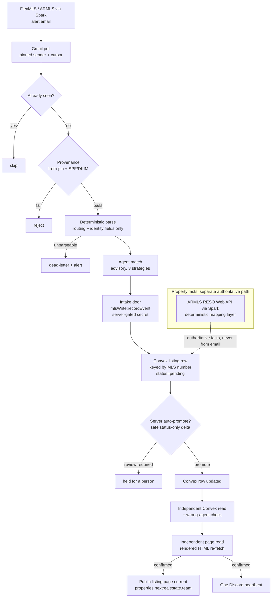

# MLS Data Pipeline

_Part of the [NEXT System Architecture](../README.md). See also the [Architecture Overview](00-architecture-overview.md)._

The MLS data pipeline keeps NEXT's live listing pages current with the multiple
listing service. It watches for changes coming out of FlexMLS / ARMLS (read
through the Spark data source, the licensed MLS data provider), turns each change
into a structured routing event, matches that event to the right agent, and
writes it into the same Convex data model the public listing pages render from.
It runs as a standing Node service, packaged in Docker, on a VPS, and it is
gated to write only during Arizona business hours so a person is present whenever
a live page changes.

The rest of this section walks the pipeline in the order data actually moves:
what triggers it, how a change is parsed and matched, how it is written, how a
status change (such as a sale) is meant to flip the page, and how the separate
open-house scheduling parser fits the same write model. Each subsection cites the
real source files.

---

## 1. What the pipeline is

The service is a poll loop. On a fixed interval it asks a mail source for new MLS
alert emails, and for each one it runs a fixed sequence of guards and, on
success, a write. The loop and its guards live in `src/pollLoop.ts`; the standing
service that drives it lives in `src/run.ts`.

Two design principles run through the whole pipeline and are worth stating up
front because they explain many of the specifics below:

- **The alert email is a doorbell, not the source of record.** The pipeline
 reads only *routing and identity* fields out of an alert (which listing, which
 agent, what kind of change, the asking price and status as printed). It never
 reads or writes property *facts*, beds, baths, square footage, descriptions,
 photos. Those authoritative facts come from the licensed MLS feed (the ARMLS
 RESO Web API, reached through Spark) applied by a deterministic mapping layer,
 never inferred from an email. `src/types.ts` fixes the exact set of fields an
 event may carry, and `src/accuracyWall.ts` (via `assertNoForbiddenFacts`)
 throws if anything outside that set ever appears on an event object. This is
 the accuracy guarantee: a wrong factual value structurally cannot reach a
 public page through this path.

- **Every guard fails closed.** Provenance, target resolution, the write
 authorization, and the promotion gates all refuse by default and only proceed
 on an explicit, valid signal. A misconfiguration suppresses writes; it never
 opens them.

### Deploy states: dark, shadow, live

The container has three honest operating states, chosen by which credentials and
flags are present (`src/run.ts`, `darkCheck()` and the promoter gates):

- **Dark.** If any required credential is missing, the service deploys dark: it
 logs that it is dark and holds idle. It never polls and never writes. This lets
 the container be brought up and stay healthy before it is fully configured.
- **Live, quarantine-only.** With credentials present but automatic promotion
 switched off, the loop runs end to end and lands each change in a holding
 ("quarantine") state for a person to release. This is the conservative default.
- **Live, auto-promoting.** With the promotion kill-switch armed *and* shadow
 mode explicitly turned off, the loop also releases safe status-only changes to
 the live page on its own, inside the business-hours window. Shadow mode is on
 unless it is explicitly set off, so a misconfigured deploy computes what it
 *would* do and writes nothing.

The pipeline is therefore genuinely live for the parse-match-quarantine path.
Fully unattended promotion to the public site is a gated capability that is off
unless two independent switches are both set, and even then it is confined to a
class of change the server itself judges safe (Section 5).

---

## 2. The data-in path

### Trigger: polling the MLS alert mailbox

FlexMLS sends listing-update alert emails to a dedicated NEXT mailbox. The
service polls that mailbox over the Gmail REST API on an interval (default five
minutes) and asks only for messages from the pinned FlexMLS sender that are newer
than a stored high-water mark (`src/gmailSource.ts`, `GmailApiSource`). The mail
source is an interface, so the same loop runs against saved sample emails offline
and against live Gmail in production with no code change.

Robustness details that matter in production:

- **Full pagination.** The list query pages through every result, so a large
 backlog of alerts is never silently truncated to the first page.
- **Per-request timeout.** Every Gmail request runs under an abort timeout, so a
 stalled socket cannot hang the loop indefinitely; the request aborts and the
 next tick retries.
- **A moving cursor plus a seen-set.** Progress is tracked by an
 epoch-millisecond cursor (the newest message handled) and a set of already-seen
 message ids (`src/state.ts`), persisted to disk. The cursor only advances, and
 a message that failed transiently *holds* the cursor just below it so it is
 re-fetched next poll rather than skipped. Nothing is processed twice; nothing
 is silently dropped.

### Per-email processing: the guard sequence

For each new email the loop runs a fixed, cheapest-and-safest-first sequence
(`src/pollLoop.ts`, `runOnce`):

1. **Already seen → skip.** No message is ever reprocessed across polls or
 restarts.
2. **Provenance → reject on any doubt** (`src/provenance.ts`). Because anyone can
 email the mailbox a forged "FlexMLS alert," each message must clear two
 independent checks a forger cannot both satisfy: the sender address must be the
 exact pinned FlexMLS mailbox (or at least its sending domain), *and* the
 receiving mail server's SPF and DKIM verdicts must both be `pass` and both
 reference the FlexMLS domain. Miss either and the email is rejected before it
 is ever parsed.
3. **Parse** the body into a structured event (Section 3). A body that can never
 be parsed is "dead-lettered", recorded and surfaced once, with the cursor
 allowed past it, so one bad email cannot pin the loop forever.
4. **Match** the listing agent to an agent slug (Section 4). Matching has no side
 effects.
5. **Write** the event through the server-gated door (Section 6). A change whose
 *type* has no home in the data model is rejected with a log line rather than
 written as an invalid row.

Error handling distinguishes three dispositions, each visible and none silent: a
genuine but unmappable alert is rejected, a permanently unparseable body is
dead-lettered, and a transient failure (network or service blip) holds the cursor
for a clean retry.

### How a change becomes a listing record

Parsing (Section 3) produces an event carrying exactly these fields
(`src/types.ts`): `mls_number`, `event_type`, `listing_agent_name`, `address`,
`city`, `state`, `zip`, `status`, `list_price`, plus provenance fields
(`email_message_id`, `raw_email_subject`, `email_received_at`). Every one is read
literally from the alert. These are the fields the write door receives.

**Create vs. update is decided on the server, keyed by MLS number, not by the
client.** The pipeline does not itself decide whether a listing is new or
existing, and it deliberately does not send its own agent match across the wire.
The write door (`mlsWrite:recordEvent`) re-derives the owning agent
authoritatively server-side and keys the listing by `mls_number`, so the same MLS
number consistently resolves to the same listing record and the same page owner
regardless of what an individual email's subject line said. This is what makes
the pipeline safe against the worst failure class, an update landing on the
wrong agent's page.

---

## 3. Parsing an alert into a routing event

Parsing is **deterministic**: pure string and regular-expression logic, no
language model, no network call, byte-identical on a re-run
(`src/mechanicalParser.ts`, entered via `src/parser.ts`). The same email always
yields the same event, so parsing has no latency, no cost, and no
nondeterminism.

A FlexMLS alert body is mechanically regular, an event phrase line
("New Listing," "Price Change"), an optional price line, an address line, and a
`<Status> - MLS #<digits>` line. The parser reads each field off that structure:

- **MLS number and status** from the `<Status> - MLS #<digits>` line, with
 backstops elsewhere in the body. No MLS number means the event cannot be routed,
 which is a terminal (dead-letter) failure rather than a guess.
- **Address**, the one genuinely ambiguous field, is decomposed into street,
 optional unit, city, state, and ZIP (`decomposeAddress`). Critically, the
 parser only accepts an address *above* the MLS line; the office/footer address
 that always sits *below* it is refused. If no listing address appears above the
 anchor, the address is treated as genuinely missing and the event is
 dead-lettered rather than risk publishing the wrong address, a silent wrong
 write to the public site is treated as the worst outcome and is designed out.
- **Event type** is classified from the event phrase, falling back to the raw
 status word, and never invented (`mapEventType`). The vocabulary is a closed set
 (`src/types.ts`): `new_listing`, `price_change`, `status_change`, `sold`,
 `back_on_market`, `withdrawn`, `expired`, `pending`.
- **Price** is normalized from a `$1,150,000.00`-style string to an integer, or
 left null.
- **Agent name** comes from the subject line (or a prose line as a backstop).

The finished event is checked one last time by the accuracy wall before it
leaves the parser, guaranteeing no property fact ever rode along.

---

## 4. Matching the listing to an agent

`src/matcher.ts` maps the alert's listing-agent name to an agent slug so the
change lands on the right person's page. The agent roster is fetched from Convex
through an **anonymous, read-only** public query (`getAllRealtorsForBuild`), no
key, no write capability.

Matching uses three strategies in order, and refuses to guess below them:

1. **Exact canonical**, normalized name equality.
2. **Token overlap**, at least two shared name tokens (best overlap wins).
3. **Distinctive single token**, one shared token that is unique to exactly one
 agent across the roster and long enough (e.g. a surname) to not be a common
 first-name collision.

Anything below that goes to a review queue with a reason, rather than being
assigned to a possibly-wrong agent. As noted above, this client-side match is
treated as *advisory only*: the authoritative owner is always the server's own
re-derivation keyed by MLS number. The client match never overrides the server,
and it never drives the wrong-agent alarm (Section 5).

---

## 5. Status changes and the sold flow

A status change, a listing going pending, back on market, withdrawn, expired, or
**sold**, is parsed like any other alert and carries the new `status` string and
a mapped `event_type`. The brain's `sold` type maps directly to the data model's
`sold` literal; its `pending` maps to the nearest accepted under-contract bucket
(`src/eventMapping.ts`), because the data model has no separate "pending"
literal. This translation happens at the write boundary so a real alert always
lands as a valid row.

Turning a status change into a *flipped page* is handled by the server's own
auto-promotion decision, not by the brain (`src/promoter.ts`, calling
`listingPages:fleetAutoPromote`). For each matched, quarantined event the brain
asks the server to auto-promote; **the server decides whether the change is a
safe status-only delta** and returns "review required" for anything it will not
auto-derive (for example a price change or a new listing). The brain classifies
nothing itself. When the server does promote a status change, the pipeline
confirms the flip on two independent reads before it announces anything:

1. **An independent Convex row read**, keyed by MLS number
 (`getListingByMlsNumber`), confirming the stored row now carries the new
 status, never trusting the write call's own return value.
2. **An independent page read**, re-fetching the rendered public page over HTTP
 and checking the new value is actually present (`src/readback.ts`).

A dedicated **wrong-agent alarm** compares the owner the server actually stored
on the rendered row against the owner the MLS number resolves to; a mismatch is
raised as a distinct alarm (never a generic lag) and suppresses any success
signal. Only when the authoritative Convex read confirms, and, where the page's
data backing is verified, the page read agrees, does the pipeline post a single
confirmation heartbeat to the team's Discord ops channel (`src/heartbeat.ts`).
Nothing is announced on an unconfirmed or wrong-agent write.

### The business-hours write window

Live promotion is additionally gated to Arizona business hours (default
08:00–20:00 America/Phoenix; `src/writeWindow.ts`). Outside the window the live
loop skips the poll entirely, so an off-hours alert is simply *held in the
mailbox*, the cursor does not advance past it, and is fetched and promoted at
the first in-window poll, never stranded. Quarantine-only and shadow modes are
unaffected and observe around the clock. The window fails closed: a bad timezone
or bound leaves it shut rather than open around the clock.

---

## 6. Connection points: how the pipeline writes the shared data model

The public listing pages and this pipeline share one Convex data model: the pages
*read* it, the pipeline *writes* it. The pipeline reaches that model through
exactly two server-gated doors and no side channel (`src/publishDoor.ts`,
`src/writeEvent.ts`):

- **Intake (quarantine):** `mlsWrite:recordEvent`, a public Convex mutation
 authenticated by a server-side shared secret supplied to the container through
 its environment (never in source, never logged). It records the event in a
 pending state; the server re-derives the agent match; a caller-supplied agent
 is rejected. Only the whitelisted routing fields cross the wire, so property
 facts cannot leak from the brain even in principle.
- **Release (promote):** `listingPages:fleetPromoteMatchedEvent` /
 `listingPages:fleetAutoPromote`, public Convex actions authenticated by a
 *separate* scoped promotion secret. Promotion happens only through this
 wrapper.

The auth model is the standard "server-gated by a shared secret": the door is
public, but it rejects any call whose bearer secret does not match the value the
server holds. The pipeline treats those secrets as opaque; this document
describes the *mechanism*, and the secret values live only in the deployment
environment.

**Target safety.** Before any write, the target deployment is resolved and
validated (`src/targeting.ts`). There is no "production if unset" default: an
unset, unknown, or production target is a hard abort raised *before* any client
is constructed or any mutation issued. Reads and writes travel separate
authorization paths, so a read can never inherit write authority.

**How a write reaches the page.** The public listing site (at
`properties.nextrealestate.team`) renders from this same Convex data model, so a
committed write to a listing row is what updates the rendered page. The pipeline
does not assume the flip happened, it *verifies* it, by the independent page
re-fetch described in Section 5, which reads the live rendered HTML back and
confirms the new value is present before the change is treated as done.

### Data-flow diagram

---

## 7. The open-house scheduling parser

Open-house scheduling is a distinct concern with its own small, standalone
library (`next-oh-parse`), vendored into the repos that need it. Its job is
narrow and self-contained: turn a freeform human/MLS open-house string
("Saturday Sep 12 2026 1-4pm refreshments") into a structured, validated schedule
payload.

### Contract (`src/openHouseParse.ts`, `src/contracts/setOpenHousesContract.ts`)

- **Input:** the freeform text, plus context, the agent slug, the listing slug,
 and an injected "now" (the caller passes the current time so year inference and
 past-date checks are reproducible and testable, never read from a hidden clock).
- **Output:** a versioned `SetOpenHousesArgs` payload, `{ realtor_slug,
 url_slug, open_houses: [{ date (YYYY-MM-DD), start_time (HH:MM 24h), end_time,
 notes? }] }`, validated against a Zod schema before it is returned, so a
 malformed field fails at the parser, not later at the write door.
- **The write door itself** (`setOpenHouses`) is owned by the listing-pages
 server, exactly as the MLS write doors are; this library is the pure parser
 that produces the door's payload, and the contract version is the explicit,
 stable boundary both sides agree on. A change to the payload shape must bump the
 contract version, and a drift test fails if the shape moves without the bump , 
 which is the signal to the consuming worker that its integration needs review.

### Fail-loud behavior ("throw rather than guess")

The parser never fabricates a missing fact. Each of these throws rather than
silently guessing:

- **No date** in the text.
- **An ambiguous time**, a bare "1–4" with no am/pm that is not an unambiguous
 24-hour time. (A trailing meridiem on one endpoint does cover the other, so
 "1-4pm" resolves cleanly; "1-4" alone is refused.)
- **A weekday that contradicts the resolved date**, e.g. the text says "Sunday"
 but the date is a Saturday.
- **A past date** stated with an explicit year. (A bare month/day with no year
 always resolves forward to the next future occurrence, never into the past.)
- **A second open house in one message**, v1 handles one at a time, and a second
 date or time range in the leftover text is refused rather than silently dropped
 into the notes field.

### How it is consumed

The parser is a pure function with a single small dependency, deliberately
carrying **no** write logic of its own: a consuming worker (the separate
open-house ads worker) is expected to gate its own write path with its own
server-gated token door, exactly the model the MLS pipeline uses. So the two
pipelines are independent code but share the same discipline, a deterministic,
fail-loud parser producing a validated payload, handed to a server-gated write
door that owns the live data model. The MLS updater and the open-house parser do
not import one another; they meet only at the shared Convex data model the public
pages read from.

---

## What is live vs. partial (honest status)

- **Live and exercised:** the poll loop; provenance verification; deterministic
 parsing; agent matching; the fail-closed target resolution; the quarantine
 intake door; the cursor/seen-set durability; the independent Convex and page
 readbacks; the business-hours window; the Discord heartbeat. The open-house
 parser library is complete, versioned, and tested as a standalone unit.
- **Gated (off unless two switches are set):** fully unattended promotion of a
 change to the public site. It requires the promotion kill-switch armed *and*
 shadow mode explicitly disabled, and even then only releases the status-only
 changes the server judges safe; everything else is left for a person.
- **Deferred by design:** the authoritative property-fact re-pull from the ARMLS
 RESO Web API (via Spark) and its deterministic mapping layer. The updater never
 touches property facts and never needs to to route status and price
 changes; the factual field-of-record path is a separate authoritative pull that
 this pipeline defers to rather than reproduces.
