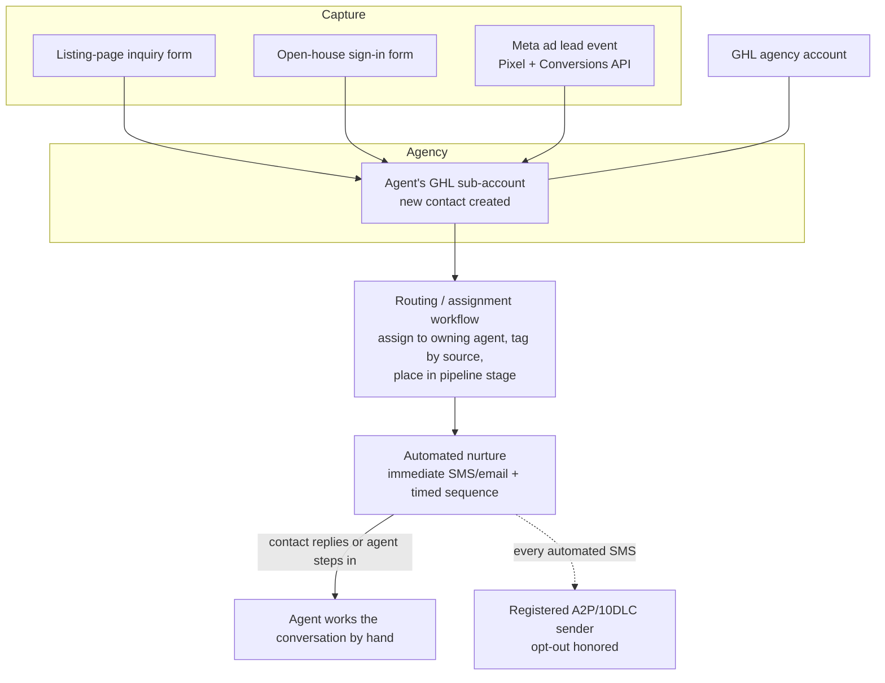

# CRM and External Integrations

_Part of the [NEXT System Architecture](../README.md). See also the [Architecture Overview](00-architecture-overview.md)._

This section describes how a lead moves through NEXT's system, from the moment it is
captured to the automated follow-up that reaches it, and the external services that
support that flow: the GoHighLevel CRM backbone, the Meta advertising integration,
the A2P/10DLC SMS compliance tooling, and NextOS Connect (the FlexMLS activity sync).
It is written at two levels. The hosted CRM and the ad integration are described as
architecture, since they are configured in third-party platforms rather than in code
NEXT owns. The compliance checker and the FlexMLS sync are described at code level,
with file references, because they are software built for NEXT.

---

## 1. The CRM Backbone: GoHighLevel

GoHighLevel (GHL) is the customer-relationship platform that holds every lead, runs
the follow-up automation, and sends the SMS and email that agents' contacts receive.

### 1.1 Account model: agency with per-agent sub-accounts

NEXT operates a single GHL **agency account**. Under that agency sits one **sub-account
per agent**. A sub-account is an isolated workspace: its own contacts, its own
pipelines, its own conversations, its own phone number and sending identity, its own
automation workflows. One agent's leads and message history are never visible inside
another agent's sub-account.

This structure is what lets NEXT grow from roughly ten agents today toward a much
larger roster without redesigning the system. Adding an agent means provisioning a new
sub-account (from a standard template so every agent starts with the same pipelines and
workflows), not rebuilding anything. Because each sub-account is self-contained, a
change or a mistake in one agent's workspace cannot affect another's.

New sub-accounts are provisioned from a template ("snapshot") so the pipeline stages,
tags, and automation workflows are identical across agents. Changes to an *existing*
agent's live sub-account are made as targeted, verified edits (read the current value,
change one field, write it back, read again to confirm), never by re-applying the
whole template, so an update to shared configuration can never overwrite an agent's
live customizations.

### 1.2 The lead lifecycle

A lead follows the same path regardless of where it came from:

1. **Capture.** A prospect's contact details enter the system through one of several
   front doors (detailed in 1.3).
2. **Land in the agent's sub-account.** The lead is created as a contact in the GHL
   sub-account belonging to the agent who owns that listing, campaign, or open house.
3. **Assignment / routing.** A workflow inside the sub-account assigns the new contact
   to the owning agent, tags it by source (which listing, which campaign, which open
   house), and places it at the top of the correct pipeline stage.
4. **Automated nurture.** Assignment triggers an automated follow-up sequence: an
   immediate first SMS and/or email, then a timed series of further touches. The
   sequence stops automatically when the contact replies or when the agent takes over
   the conversation.
5. **Agent steps in.** The agent works the conversation by hand from that point, inside
   the same sub-account, with the full capture-source and activity history attached to
   the contact.

Every message the automation sends runs on a registered, carrier-approved SMS sender
(the reason the A2P/10DLC compliance tooling in section 3 exists) and every automated
message carries an opt-out instruction.

### 1.3 Where leads come from (capture sources)

- **Listing-page forms.** The public listing pages (served under the properties site)
  carry inquiry forms. A submission creates a contact in the listing agent's
  sub-account, tagged with the specific property.
- **Open-house forms.** A sign-in form captured at an open house feeds the same
  sub-account, tagged to that property and that event.
- **Meta lead events.** Leads generated by the agent's Facebook/Instagram advertising
  arrive as lead events (see section 2) and land in the same sub-account for routing
  and nurture.

All three converge on the same place: the owning agent's sub-account, where one set of
routing and nurture workflows handles the lead no matter which door it came through.

---

## 2. Meta Advertising Integration

Each agent's advertising is tracked with a **per-agent Facebook Pixel** paired with the
**Conversions API (CAPI)**, Meta's server-side event channel.

### 2.1 Two-sided event tracking

- The **Pixel** is the browser-side tag on the agent's pages. It fires when a visitor
  loads a listing page or completes a form, and reports that event to Meta from the
  visitor's browser.
- The **Conversions API** reports the same events **server-side**, from NEXT's
  infrastructure directly to Meta, rather than depending on the browser. Server-side
  events are not lost to ad blockers, browser tracking-prevention, or a page that
  closes before the browser tag finishes.

Running both and de-duplicating the overlap is the current best-practice pattern for ad
attribution: the browser Pixel and the server CAPI report the same conversion, Meta
matches them, and the advertiser gets a complete and accurate count. Each agent has
their own Pixel identifier and their own CAPI access credential, so ad performance and
attribution are isolated per agent, matching the per-sub-account CRM model. (The
identifiers and credentials themselves are configuration held server-side; only the
mechanism is described here.)

### 2.2 The open-house ad flow

An open house can trigger a Meta ad. Scheduling an open house can spin up an ad
campaign promoting that event to a local audience. Responses to that ad flow back
through the same lead path as everything else: the lead event is captured (Pixel plus
CAPI), it lands in the hosting agent's GHL sub-account tagged to that open house, and
the routing and nurture workflows take over. Ad attribution and CRM follow-up are two
views of the same lead, joined at the sub-account.

---

## 3. A2P / 10DLC SMS Compliance Tooling

### 3.1 Why it exists

US mobile carriers require that any business sending SMS from a standard 10-digit local
number be registered through the A2P (Application-to-Person) 10DLC program. Unregistered
business SMS is filtered or blocked by the carriers. Because every agent has their own
sub-account with its own sending number, **every agent is a separate business SMS sender
that must be individually registered** before the automated nurture in section 1.2 can
reach anyone reliably.

Registration has two hard prerequisites that a person otherwise has to check by hand for
every agent: the agent's public website must carry specific consent and policy elements,
and a registration packet of business and campaign details must be assembled correctly.
The `next-a2p-compliance` tool automates both checks. It is a Phase 1, offline-first
toolkit: it verifies and generates paperwork, and it never submits anything to any
carrier, registrar, or GHL. A person still files the result by hand.

### 3.2 Component A: the website compliance checker

**Contract** (`src/website-checker.ts`): `checkWebsiteCompliance(siteUrl, fetcher,
options)` fetches an agent's website and returns a structured `ComplianceReport`
(`src/types.ts`) listing every rule, whether it passed, its severity, and a
human-readable detail string. The report's `overallPass` is true only if every rule of
severity `"fail"` passed; `"warn"` rules never block.

The fetching mechanism is deliberately pluggable. The checker takes a `PageFetcher`
function rather than reaching the network itself. Tests run against fixture HTML; a
real network fetch is opt-in only, through a separately named `liveFetcher`
(`src/live-fetcher.ts`) that a caller must explicitly wire in. That live fetcher only
ever requests the agent's own public marketing website. By construction it never touches
a carrier, GHL, or any other client-system API.

**Rules checked** (each cites its source requirement in the code):

- `SITE_LIVE`: the home page is reachable and returns a success status.
- `NOT_UNDER_CONSTRUCTION`: the home page is not a placeholder or "coming soon" page.
- `BUSINESS_NAME_DISPLAYED`: the agent's business name appears on the home page (run
  only when an expected name is supplied).
- `PRIVACY_POLICY_LINKED`: a privacy policy page is linked from the site.
- `PRIVACY_POLICY_SMS_LANGUAGE`: the privacy policy page states that mobile information
  will not be shared with third parties or affiliates for marketing. This is the single
  most common A2P rejection reason, and the checker matches several accepted phrasings
  of that non-sharing language.
- `TERMS_LINKED`: a terms and conditions page is linked.
- `OPTIN_FORM_PRESENT`: a form collecting a phone number exists on the site.
- `OPTIN_CONSENT_EXPLICIT`: that form has an explicit SMS-consent checkbox, so consent
  is affirmatively given rather than implied by submitting the form.
- `OPTIN_NOT_PRESELECTED`: the SMS-consent checkbox is not pre-checked by default (a
  pre-checked box is a rejection reason).

When the site is unreachable, the checker still returns the **full fixed rule set** with
every dependent rule marked "not evaluated" rather than silently omitting rules, so a
caller scanning the report always sees the same shape.

**Honest limits, flagged in code rather than faked.** The tool refuses to assert things
it cannot verify from HTML alone. It does not judge whether opt-in copy is
"CTIA-compliant" (the source guidance never fixes the exact wording), it does not
enforce the separate marketing-versus-transactional checkbox split, and it does not
attempt to verify social-profile, age-gating, or app-store requirements. Those are left
to a human reviewer, and the code says so explicitly in a GAPS note.

### 3.3 Component B: the registration packet generator

**Contract** (`src/packet-generator.ts`): `generatePacket(agent, today)` takes an
`AgentRecord` (name, brokerage, optional DBA, website, opt-in form URL, area served,
contact email and mobile, US address, and EIN status) and returns a `RegistrationPacket`:
the exact field-set a person types into GHL's Trust Center by hand. It writes nothing
anywhere.

The packet contains the registration route and the reason for it, the business and
brokerage names, contact details and address, a use-case description, two sample SMS
messages, the opt-in form URL, an opt-in flow description, an opt-in confirmation
message, a set of field checks, a list of steps that must be done by a human, and any
warnings.

**The routing rule** (`determineRoute`) decides Sole Proprietor versus Low Volume
Standard registration from the agent's EIN (federal tax ID) status:

- **No EIN on file** to Sole Proprietor.
- **EIN active 90 or more days** to Low Volume Standard.
- **Brand-new EIN (under 90 days)** to Sole Proprietor anyway. A freshly issued EIN
  takes weeks to propagate into the carrier registry, so submitting it as a Standard
  brand immediately would fail. Routing it as Sole Proprietor is the reliable path until
  it propagates.

**Content generation rules:**

- **Business-name check.** On the Sole Proprietor route, a name containing a corporate
  term (LLC, Inc, Corp, Ltd) is flagged as disqualifying, because Sole Proprietor
  registration is for individuals, not incorporated entities.
- **Public-email check.** On the Sole Proprietor route, the contact email must be on a
  recognized public domain (Gmail, Yahoo, Hotmail, Outlook, AOL, iCloud). Anything
  outside that conservative allowlist is flagged for manual review rather than silently
  accepted or rejected, because the source guidance's list is open-ended.
- **Use case and sample messages** are built from the agent's own details, following the
  real-estate templates in the source guidance. The sample messages are **paraphrased,
  never copied verbatim**, because the registrar rejects submissions that reuse the
  example text word for word. Every generated sample includes a STOP/opt-out
  instruction.
- **Required manual steps** are surfaced explicitly for anything a script cannot verify:
  confirming the mobile number is a real mobile line and not a VoIP number, completing
  the email and mobile one-time-password checks, and passing identity verification
  (government photo ID plus a live selfie). The generator never claims these are done.

**Roster-wide budget check** (`checkRosterContactBudget`): the carriers cap how many
brands can share one contact detail. One email can back at most five brands; one mobile
number can validate at most three Sole Proprietor brands. Given the full agent roster,
this function reports any shared email or mobile that would exceed those limits before
registrations are filed, catching a problem that only shows up when several agents are
registered together.

The public surface of the toolkit is the small set of functions exported from
`src/index.ts`: the website checker, the route and packet functions, the roster budget
check, and the explicitly-named opt-in live fetcher.

---

## 4. NextOS Connect: FlexMLS Activity to CRM Sync

**NextOS Connect is a separate product on its own hosting, distinct from the core NEXT
listing platform.** It is a separate NEXT SaaS product, described here because it plugs into
the same GHL CRM backbone that the rest of the system uses. Where the sections
above describe systems NEXT runs for its agents, NextOS Connect is a product an agent
subscribes to and connects to their own accounts.

### 4.1 What it does

NextOS Connect watches an agent's contacts inside FlexMLS (the MLS platform, reached
through its Spark API) and pushes that activity into the agent's CRM, GoHighLevel first.
The value is that an agent's CRM stops being a static address book and starts reflecting
what each contact is actually doing: which homes they viewed, how many in the last seven
days, when they were last active, what the most recent property was. That turns "who do I
call today" from a guess into a sorted list.

### 4.2 Hosting and stack

NextOS Connect is a self-contained web application, hosted separately from the NEXT
platform:

- **Front end:** React with TypeScript, built with Vite.
- **Back end:** an Express (Node) server.
- **Database:** managed PostgreSQL (Neon serverless), accessed through the Drizzle ORM.
- **Accounts and auth:** Clerk manages sign-in and verified email identity. A Clerk
  session resolves to a per-agent local account, and application access is gated
  server-side by an active entitlement.
- **Payments:** Stripe, on a tiered subscription (Individual, Team, and a contact-sales
  Enterprise tier), with a card-up-front free trial. During the trial the full
  historical back-fill is held while live going-forward updates still run.

Each agent connects **their own** two credentials: their own MLS (Spark) access, and
their own CRM sub-account. Those credentials are stored encrypted, server-side, and keyed
to that agent's local account. This mirrors the per-agent isolation of the CRM backbone:
one agent's MLS data and CRM writes never cross into another's.

### 4.3 Data model (`shared/schema.ts`)

The sync is built around a few tables that keep it idempotent (safe to run repeatedly
without creating duplicates):

- `agent_connections`: one row per agent, linking their Spark identity to their GHL
  location and pointing at where their stored, encrypted GHL credential lives. The token
  itself is never copied into this row, only referenced.
- `contact_sync_map`: maps each Spark contact to the contact created in GHL, and stores a
  `content_hash` of the contact's key fields so an unchanged contact can be skipped on
  the next run.
- `sync_runs`: one row per sync attempt (including previews), recording created, updated,
  skipped, and error counts for an auditable history.
- `crm_connections`: the stored per-agent CRM credential and the agent's sync options
  (which extra fields to write, whether to apply a "hot lead" tag, whether to create a
  task or an opportunity, and which pipeline and stage to use).

The set of activity fields the agent can map into their CRM is a fixed catalog
(`shared/crm-fields.ts`): engagement level, homes viewed in the last seven days, last
activity date, totals (listings viewed, shared, saved; saved searches; emails opened),
and the latest property's details. Each maps either to an existing CRM custom field or to
one the product creates on the agent's behalf.

### 4.4 The sync pipeline (`server/sync-pipeline.ts`)

The sync runs in two modes, both keyed to a single agent:

- **Preview (dry run):** pulls the agent's Spark contacts and computes exactly what
  *would* happen, how many contacts it would create versus update versus skip, using only
  read-only lookups. It writes **nothing** to the CRM. This is what an agent runs to see
  the effect before committing. Read-only CRM lookups are capped per run so an agent with
  a very large book of business cannot trigger thousands of API calls in one preview.
- **Live sync:** does the same pull, then actually creates and updates contacts in the
  agent's GHL sub-account. Each contact is isolated in its own error boundary, so one bad
  record never aborts the whole run.

Both modes stop early with a clear message if the agent has not connected their MLS
access or their CRM credential. De-duplication is layered: the product's own sync map is
checked first (free, no API call), and only contacts it has not seen before are looked up
in the CRM by email, so an existing contact is updated rather than duplicated. When the
live sync owns the writes for an account, it disables any legacy background auto-sync on
that same account so two processes cannot push conflicting contacts.

### 4.5 GoHighLevel client (`server/ghl.ts`)

The connector talks to GoHighLevel's HTTP APIs directly and is **version-aware**. It
supports both the current API (a Private Integration or OAuth token against
`services.leadconnectorhq.com`) and the legacy API key (against `rest.gohighlevel.com`).
It guesses the version from the credential's shape, then confirms it with a live
read-only call, and if a credential is mislabeled it transparently retries against the
other version. This means an agent can paste whichever kind of key they have and the
product adapts, rather than failing.

### 4.6 Engagement scoring and anti-spam

Contacts are scored Hot (five or more homes viewed in the last seven days), Warm (one to
four), or Cold (zero). The connector then acts on the **transition** between a contact's
previous level and their new one, not on the raw level, which is what keeps a full re-sync
from spamming the agent:

- The "hot lead" tag is two-way: added when a contact becomes hot, removed when they cool.
- A follow-up task and a CRM opportunity are created **only** on the transition into hot,
  and the opportunity is guarded so exactly one is ever created per contact. A contact
  that stays hot across many syncs is not re-actioned every time.

### 4.7 Honest status

The product targets **GoHighLevel first**; a Follow-up Boss provider path also exists but
is thinner (it lacks the optional tag, task, and opportunity actions, which are guarded so
that provider is simply unaffected by them). The engagement, mapping, and preview
mechanics are built and tested; NextOS Connect remains a distinct product on its own
hosting and account system, connected to NEXT's world only through the per-agent CRM
sub-account each agent chooses to link.

---

## 5. How the pieces fit

The through-line across all four areas is **per-agent isolation with a shared shape**.
Every agent has their own CRM sub-account, their own ad Pixel and CAPI credential, their
own A2P registration, and (if they subscribe) their own NextOS Connect connection, yet all
of them run the same pipeline stages, the same nurture workflows, the same compliance
rules, and the same activity fields. That is what lets NEXT operate one coherent system
across a growing roster: leads from listing pages, open houses, and Meta ads all land in
the owning agent's sub-account, get routed and nurtured the same way, reach contacts over
a properly registered SMS sender, and (through NextOS Connect) stay current with what each
contact is doing in the MLS.
